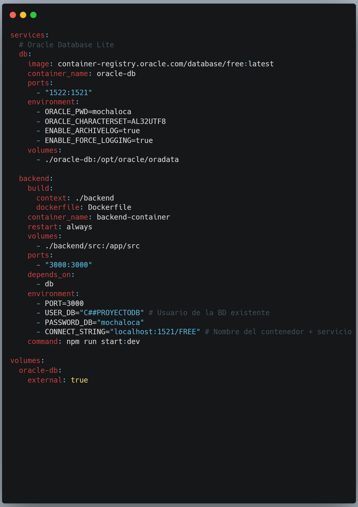
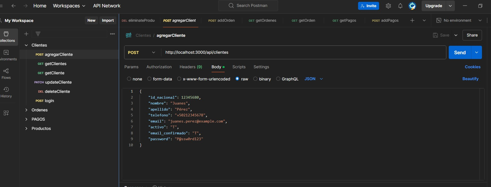
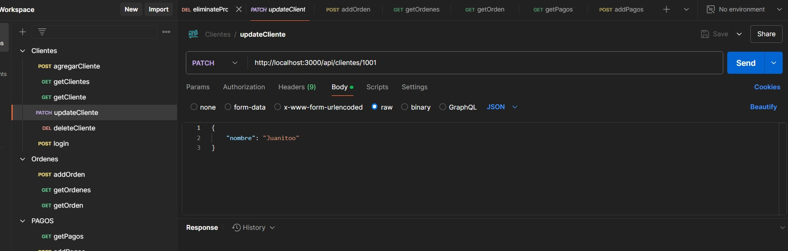
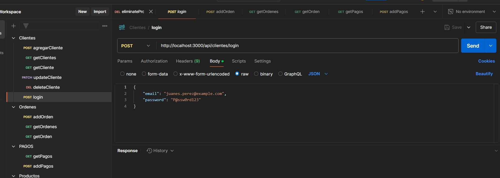

# Manual de usuario

## Requisitos previos

Antes de comenzar, asegúrate de tener instalados los siguientes programas en tu máquina:

- Node.js: La versión recomendada es la más reciente LTS (Long Term Support). Puedes verificar si tienes Node.js instalado y su versión ejecutando el siguiente comando en la terminal:

        node -v

- npm: npm es el gestor de paquetes de Node.js. Se instala automáticamente junto con Node.js. Verifica su instalación con:

        npm -v

- Docker : Si se utiliza Docker para manejar la base de datos o la aplicación, asegúrate de tener Docker instalado. Verifica su instalación con:

        docker --version

- Postaman: Se utiliza para poder hacer pruebas de los endpoints realizados en el backend ya que no se posee un Frontend.

## Clona el repositorio

Para comenzar, clona el repositorio en tu máquina local. Abre una terminal y ejecuta el siguiente comando:

        git clone https://github.com/tu-usuario/tu-repositorio.git

Reemplaza el enlace con el URL de tu repositorio de GitHub.

## Instala dependencias

1. Navegar a la carpeta del proyecto
En la terminal, navega a la carpeta de tu proyecto recién clonado:

        cd tu-repositorio

2. Instalar las dependencias
Una vez que estés dentro del proyecto, ejecuta el siguiente comando para instalar las dependencias necesarias:

        npm install

Este comando leerá el archivo package.json y descargará todas las dependencias necesarias para ejecutar el proyecto.

3. Configuración del entorno
Es posible que necesites configurar algunas variables de entorno antes de ejecutar la aplicación, como la base de datos, puertos, etc.

Crea un archivo .env en la raíz del proyecto (si no existe) y agrega las variables necesarias. Un ejemplo de archivo .env podría ser:

        PORT=3000\nUSER_DB="C##proyectoDB"\nPASSWORD_DB="mochaloca"\nCONNECT_STRING="localhost:1521/FREE"

4. Configuración del archivo Docker-compose:
Debes configurar el archivo docker-compose-yml para poder conectarte con la imagen y el contenedor de la base de datos, a continuación el ejemplo:

## Ejecutando la aplicación:

- En modo de desarrollo
Para ejecutar la aplicación en modo de desarrollo, usa el siguiente comando:

        npm run start:dev

Este comando ejecutará el servidor NestJS en modo de desarrollo, permitiendo la recarga automática de la aplicación cuando se realicen cambios en el código.

## Pruebas con Postman
Se realizan pruebas con postman para verificar el funcionamiento de los endpoints de la API, a continuación se presenta el agregar Clientes desde postman:

Se muestra a continuación la estructura para el update de clientes:

Se muestra a continuación la estructura para el login de clientes:

