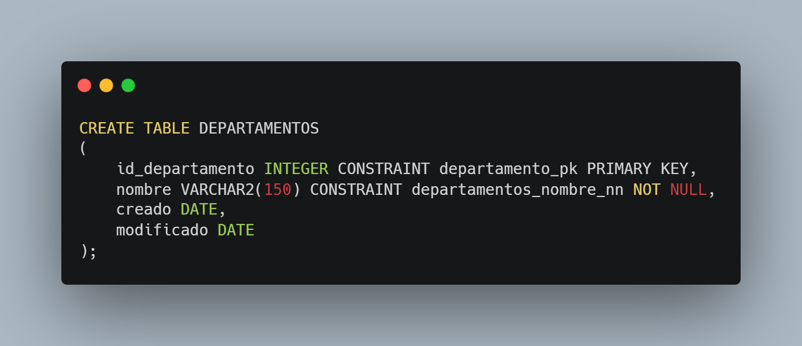

# Proyecto - Bases de datos 1

## Enunciado
En el contexto de los sistemas de comercio electrónico, la gestión eficiente de datos es fundamental para garantizar el correcto funcionamiento de las operaciones de compra, venta y distribución de productos. Este proyecto tiene como objetivo el diseño y desarrollo de una base de datos relacional eficiente y normalizada para un centro de ventas en línea de gran escala, similar a plataformas como Amazon o Alibaba. La base de datos deberá estructurarse siguiendo los principios de integridad referencial y normalización, permitiendo el almacenamiento y procesamiento de grandes volúmenes de información de manera óptima. Se considerarán entidades clave como usuarios, trabajadores, productos, órdenes de compra, pagos, envíos, devoluciones y traslados de productos, asegurando una relación coherente y escalable entre los diferentes elementos del sistema. Adicionalmente, el sistema deberá ser capaz de incorporar datos de manera automatizada, no solo mediante cargas masivas desde archivos CSV, sino también a través de una API de integración que permita la comunicación con plataformas externas y facilite la actualización en tiempo real de la información. Se sabe que en un centro de ventas en línea es fundamental contar con una gestión eficiente de los usuarios, quienes interactúan en la plataforma con distintos roles. Un usuario puede ser un cliente, y para su identificación es necesario almacenar un identificador único, identificación nacional, nombre, apellido, correo electrónico, número de teléfono, si está activo, la fecha de registro en la plataforma y si confirmó su correo. También debe incluir información adicional como direcciones y métodos de pago preferidos por motivos de personalización de la página. Para el correcto funcionamiento del sistema, también es necesario registrar a los trabajadores encargados de la administración y logística de la plataforma. Cada trabajador debe contar con un identificador único, identificación nacional, nombre, apellido, cargo, departamento en el que labora, número de teléfono y correo institucional. Además, los trabajadores relacionados con la logística y almacenes deben estar vinculados a una sede o centro de distribución específico y si está activo. El sistema debe gestionar una amplia variedad de productos, los cuales requieren un control detallado. Cada producto debe contar con un identificador único, SKU del producto, nombre, descripción, precio, slug, cantidad en inventario por sede/centro y categoría. Además, se debe almacenar información sobre la disponibilidad del producto (activo o no) y una referencia a las imágenes asociadas para su visualización en la tienda en línea. Por razones de control financiero y trazabilidad de las transacciones, se debe registrar la información de cada orden de compra. Una orden debe contar con un número de identificación único, la fecha de creación, el identificador del cliente que realizó la compra y la lista de productos adquiridos con sus respectivas cantidades y precios unitarios. Los pagos son un componente esencial del sistema y deben ser gestionados de manera segura y eficiente. Cada pago debe estar vinculado a una orden de compra y debe contar con un identificador único, la fecha de la transacción, el monto total, el método de pago utilizado (tarjeta de crédito, transferencia bancaria, billetera electrónica, entre otros) y el estado del pago, que puede ser "pendiente", "aprobado" o "rechazado". Para garantizar la entrega eficiente de los productos adquiridos, se debe administrar la información de los envíos. Cada envío debe contar con un identificador único, la fecha de despacho, el número de orden de compra asociado, la dirección de entrega, la empresa de transporte encargada, el número de seguimiento y el estado del envío, que puede ser "en tránsito", "entregado" o "devuelto". En el caso de productos que no cumplen con las expectativas del cliente o presentan defectos, es necesario gestionar las devoluciones. Cada devolución debe estar vinculada a una orden de compra y debe contar con un identificador único, la fecha de solicitud de devolución, el motivo de la devolución, el estado del proceso (en revisión, aprobada, rechazada) y el producto. Para optimizar la distribución de productos entre las distintas sedes y centros de distribución, se debe administrar los traslados internos de productos. Cada traslado debe contar con un identificador único, la fecha de movimiento, el almacén de origen y el almacén de destino, lista con el identificador del producto trasladado y la cantidad transferida. Además, se debe registrar el estado del traslado y la fecha estimada de llegada al nuevo destino. Todas las tablas que se creen tendrán que llevar los campos de fecha de creación (created_at) y fecha de modificación (updated_at).
## Solución propuesta

### Modelos
#### Esquema Conceptual

#### Esquema Lógico

#### Esquema Fisico

### Fases del proceso de normalización

#### Primer forma normal

La primer forma normal es aplicable a muchos objetos, entidades y posteriormente tablas para el correcto funcionamiento, se presenta como se aplica en el caso de empleados y departamentos en el cual un departamento posee muchos empleados.

#### Segunda forma normal 

La segunda forma normal es aplicable a muchos objetos, entidades y posteriormente tablas para el correcto funcionamiento, se presenta como se define "detalles ordenes" para relacionar muchos productos a muchas ordenes, obteniendo así evitar una relación N:N.

#### Tercera forma normal 

La tercera forma normal es aplicable a muchos objetos, entidades y posteriormente tablas para el correcto funcionamiento, se presenta como se define "departamentos, "sedes" y  "categorías", en las cuales se aplicó la 3ra forma normal ya que no existen dependencias transitivas, es decir, todo atributo no clave debe depender únicamente de la clave primaria.

<table>
  <tr>
    <td></td>
    <td></td>
  </tr>
  <tr>
    <td colspan="2" align="center"></td>
  </tr>
</table>

### Descripción de tablas

#### Tabla Categorías, Imagenes, Departamentos, Envíos, Direcciones y Metodos Pago

Las tablas categorías, imágenes, departamentos, envíos, direcciones y Métodos_pago forman parte de un sistema de gestión de productos, clientes, empleados y envíos.
- **CATEGORÍAS** almacena las categorías de productos, mientras que **IMÁGENES** gestiona las imágenes asociadas a los productos.
- **DEPARTAMENTOS** y **EMPLEADOS** están relacionadas para gestionar el personal de la empresa.
- **ENVIOS** gestiona el proceso de envío de las órdenes de los clientes, y **DIRECCIONES** almacena las direcciones asociadas a los clientes para su envío.
- **METODOS PAGO** permite registrar los métodos de pago de los clientes.

    
    
    
    
    
    

Cada una de estas tablas tiene claves primarias y foráneas que permiten su interconexión para mantener la integridad referencial y facilitar el acceso y manejo de la información dentro del sistema.

#### Tabla Clientes, empleados, productos y ordenes
Las tablas **CLIENTES**, **ORDENES**, **PRODUCTOS** y **EMPLEADOS** forman parte de un sistema integral para la gestión de la información de clientes, productos, empleados y las órdenes generadas dentro de la empresa.

- **CLIENTES** almacena la información de los clientes que interactúan con la empresa, incluyendo atributos como nombre, apellido, teléfono, email, y su estado de actividad.
- **ORDENES** gestiona las compras realizadas por los clientes, relacionando cada orden con un cliente y una sede de la empresa, con fechas de creación y modificación para controlar el proceso de compra.
- **PRODUCTOS** administra los productos disponibles en el sistema, incluyendo el código único (sku), nombre, precio, y categoría a la que pertenece cada producto.
- **EMPLEADOS** contiene la información sobre los empleados de la empresa, como nombre, apellido, puesto, teléfono, y email, y se relaciona con las tablas **SEDES** y **DEPARTAMENTOS** para gestionar la ubicación y departamento correspondiente de cada empleado.

  
  
  
  

Estas tablas interactúan entre sí a través de claves foráneas que mantienen la integridad referencial del sistema. La relación entre Clientes y Órdenes permite gestionar las compras de los clientes, mientras que la relación entre Productos y Órdenes (a través de las órdenes) facilita el seguimiento del inventario. Por otro lado, la tabla Empleados asegura que la empresa pueda administrar correctamente su personal, asignando departamentos y sedes específicos para cada uno.

#### Tabla detalles ordenes, detalles traslados, inventarios, pagos orden, productos devoluciones,sedes y traslados.

Las tablas **DETALLES_ORDENES**, **DETALLES_TRASLADOS**, **INVENTARIOS**, **PAGOS_ORDEN**, **PRODUCTOS_DEVOLUCIONES**, **SEDES** y **TRASLADOS** forman parte de un sistema de gestión integral que controla los detalles de las órdenes, traslados, inventarios, pagos, devoluciones de productos y el manejo de sedes.

- **DETALLES_ORDENES** gestiona los productos asociados a cada orden de compra, incluyendo la cantidad, precio y la relación con las tablas de **ORDENES** y **PRODUCTOS**.
- **DETALLES_TRASLADOS** almacena los productos involucrados en cada traslado entre sedes, registrando la cantidad de productos y asociándolos con las tablas de **TRASLADOS** y **PRODUCTOS**.
- **INVENTARIOS** lleva el control del inventario disponible en cada sede, asociando la cantidad de productos con las sedes correspondientes.
- **PAGOS_ORDEN** gestiona los pagos realizados por los clientes en las órdenes, registrando el método de pago y el estado del pago, y relacionando cada pago con una **ORDEN**.
- **PRODUCTOS_DEVOLUCIONES** almacena los productos que han sido devueltos por los clientes, con información sobre el estado y la descripción de la devolución.
- **SEDES** gestiona las diferentes ubicaciones físicas de la empresa, siendo referenciada en varias tablas como **EMPLEADOS**, **ORDENES**, **INVENTARIOS** y **TRASLADOS**.
- **TRASLADOS** controla el proceso de traslado de productos entre diferentes sedes, incluyendo el estado del traslado y las fechas de arribo estimado y solicitado.

  
  
  
  
  
  
  

### Descripción de la API
#### Tecnologías Utilizadas
- **NestJS**: Framework para construir aplicaciones backend escalables y mantenibles basado en Node.js y TypeScript. Utiliza el patrón de diseño modular y aprovecha las capacidades de TypeScript para ofrecer una estructura robusta y de fácil mantenimiento.
- **Docker**: Plataforma de contenedores que permite empaquetar la aplicación y sus dependencias en un solo contenedor, asegurando que funcione de manera consistente en cualquier entorno, desde desarrollo hasta producción.
- **TypeScript**: Superset de JavaScript que añade tipado estático a los archivos, mejorando la experiencia de desarrollo, la detección de errores y la comprensión del código a medida que el proyecto crece.

#### Estructura

La API está construida siguiendo una arquitectura modular, lo que significa que cada recurso de la aplicación (como usuarios, productos, órdenes, etc.) tiene su propio módulo. Cada módulo contiene sus controladores, servicios y modelos relacionados, lo que facilita la escalabilidad y el mantenimiento de la aplicación.

- Módulos: Cada funcionalidad de la API está organizada en módulos, como clientes, productos, ordenes, entre otros. Esto permite una separación clara de responsabilidades y facilita la gestión de dependencias.

- Controladores: Los controladores definen las rutas de la API. Por ejemplo, en el clientes controller se gestionan las peticiones HTTP relacionadas con los usuarios (crear, leer, actualizar, eliminar usuarios). Los controladores delegan la lógica de negocio a los servicios.

- Servicios: Los servicios contienen la lógica de negocio. Por ejemplo, en el clientes service se realizan las operaciones necesarias para interactuar con la base de datos y gestionar los usuarios.

- DTOs (Data Transfer Objects): Los DTOs son utilizados para definir cómo deben ser los datos que entran y salen de la API. Esto asegura que la estructura de los datos sea consistente y valida los datos antes de que lleguen a la base de datos.

#### Docker
El proyecto está empaquetado en un contenedor Docker para simplificar la implementación y garantizar que la API funcione en cualquier entorno, desde desarrollo hasta producción. El contenedor de la aplicación se define en un archivo Dockerfile y se gestiona mediante Docker Compose para orquestar la base de datos y otros servicios necesarios.

- Dockerfile: Define el entorno de ejecución de la API, incluyendo la instalación de dependencias, la configuración de puertos y la ejecución de la aplicación.
- docker-compose.yml: Orquesta el arranque de múltiples contenedores, como la base de datos y la API, facilitando el proceso de configuración y ejecución del entorno de desarrollo.
#### Endpoints y Funcionalidad
A continuación, algunos ejemplos de los endpoints de la API:

- Clientes:
    - POST /api/clientes: Registra un nuevo cliente(usuario).
    - GET /api/clientes: Recupera todos los clientes.
    - GET /api/cliente/id: Recupera los detalles de un cliente.
    - PATCH /api/clientes/id: Actualiza la información de un cliente a excepción de password.
    - DELETE /api/clientes/id: Desactiva un cliente.
    - POST /api/clientes/login: Autentica a un cliente y devuelve un idSession.

- Productos:
    - GET /api/productos: Recupera la lista de productos disponibles.
    - GET /api/productos/id: Recupera los detalles de un producto.
    - POST /api/productos: Crea un nuevo producto.
    - PATCH /api/productos/id: Actualiza la información de un producto.
    - DELETE /api/productos/id: Elimina un producto

- Ordenes:
    - POST /api/ordenes: Crea una nueva orden de compra.
    - GET /api/ordenes : Recupera los detalles de todas las ordenes.
    - GET /api/ordenes/id : Recupera los detalles de una orden específica.

- Pagos:
    - GET /api/pagos : Recupera los detalles de todas los pagos.
    - POST /api/pagos: Crea un nuevo pago.

#### Seguridad
La seguridad es un aspecto clave, y se implementan las siguientes prácticas:

- Validación de datos: Se utilizan pipes en NestJS para validar los datos de entrada, asegurando que las solicitudes contengan la información correcta y evitando inyecciones de datos maliciosos.
CORS: Se configura CORS para permitir solicitudes solo desde orígenes confiables.
- Encriptación: Las contraseñas de los usuarios se encriptan utilizando bcrypt antes de almacenarlas en la base de datos.
#### Escalabilidad
La API está diseñada para ser fácilmente escalable. Gracias a la arquitectura modular y a la utilización de contenedores Docker, se pueden agregar nuevos módulos y servicios sin afectar el rendimiento general de la aplicación. Además, la base de datos y otros servicios pueden escalarse horizontalmente si es necesario.

